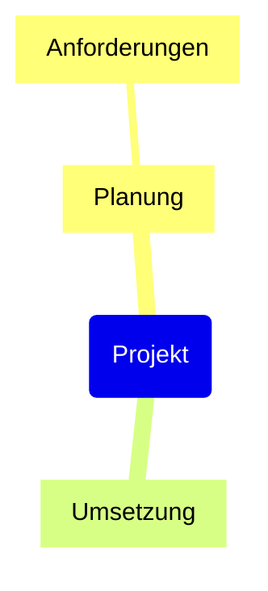

# Mermaid für Dokumentation

Stand: 7. Oktober 2026. Im Exportdialog stehen zwei zusätzliche Formate in der Gruppe „Text“ zur Verfügung:

- **Mermaid-Diagramm (`.mmd`)**: vollständige Knotenstruktur einer Karte, auch bei eingeklappten Zweigen. Bei mehreren ausgewählten Karten wird je Karte eine Datei in einen gewählten Ordner geschrieben.
- **Mermaid mit Notizen (`.md`)**: eine Markdown-Datei mit einem Mermaid-Block pro Karte. Kartennotizen, Knotennotizen und zusätzliche Notes-Widgets folgen als lesbare Textabschnitte. Überschriften ordnen sie mit Knotenname und Export-ID wie `n3` eindeutig dem Diagrammquelltext zu.

## In eine Dokumentation einfügen

Die Markdown-Datei im Texteditor öffnen und den Block einschließlich der umschließenden Zeilen in die Dokumentation kopieren:

````markdown

````

Bei einer `.mmd`-Datei die Zeilen ` ```mermaid ` und ` ``` ` selbst um den Inhalt ergänzen. Ein Mermaid-fähiger Markdown-Viewer rendert den Block. Der Export selbst benötigt weder Node.js noch eine Mermaid-Installation; zum Anzeigen braucht das Zielsystem Mermaid-Unterstützung für `mindmap`.

Die Ausgabe folgt der [Mermaid-Mindmap-Syntax](https://mermaid.js.org/syntax/mindmap.html). Geprüft wurde sie mit Mermaid 11.12.0 und einem lokalen Chromium-/WebView2-Renderer. Die Mermaid-Version des Zielsystems kann das Layout und die Darstellung beeinflussen.

## Umfang und Grenzen

- Übertragen werden Knotenbeschriftungen, Eltern-Kind-Beziehungen und die Reihenfolge der Geschwister. Doppelte Beschriftungen erhalten unterschiedliche Export-IDs. Zeilenumbrüche und Unicode einschließlich Emoji im Text bleiben erhalten.
- Das Layout berechnet Mermaid neu. Farben, Schriften, Blumind-Formen, Symbole/Bilder, Fortschrittsanzeigen, Hyperlink-Aktionen und zusätzliche Querverbindungen werden in diesem einfachen Export nicht übertragen.
- In `.mmd` sind Notizen nicht enthalten. In `.md` werden sie zu normalem Text mit Absätzen und Zeilenumbrüchen umgewandelt. HTML-Formatierungen, Bilder, Tabellenlayout und aktive Inhalte werden nicht erhalten. Bildnotizen ohne Text können daher entfallen.
- `.mmd` enthält eine Karte; `.md` kann mehrere Karten enthalten. Unterschiedliche Karten mit gleichem Namen überschreiben sich beim Ordnerexport nicht.
- Die Ausgabe verwendet UTF-8 ohne BOM. Sonderzeichen und Zeichenfolgen, die Mermaid-Syntax oder Markdown-Blöcke verändern könnten, werden maskiert.
- Es gibt keinen Mermaid-Import und keine verlustfreie Rückkonvertierung. Die `.bmd`-Datei bleibt die vollständige Arbeitsdatei; der Export verändert sie nicht.
